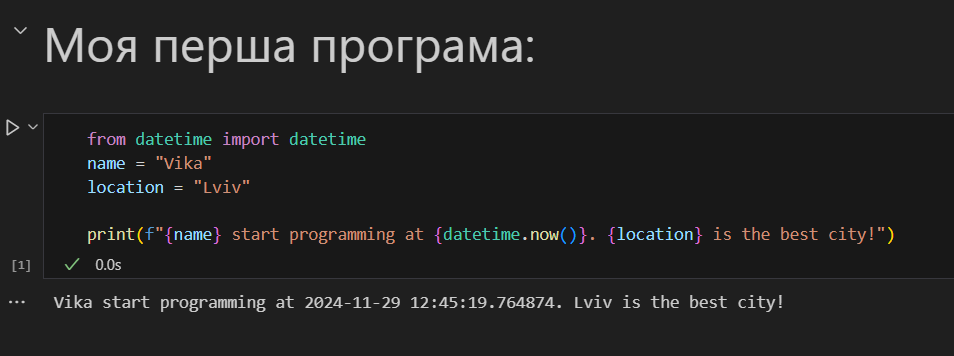

# Лабораторна робота №1
## Тема: оформлення робіт та перша програма
### Мета роботи: налаштувати середовище, створити репозиторій, попрацювати з Markdown та оформити звіт.

---
## Виконання роботи
* ### Результати виконання завдань:
    1. Створила репозиторій.
    1. Навчилась працювати із репозиторіями у GitHub у зв'язці із Visual Studio Code.
    1. Написала свою [першу програму Python](./main.py), та успішно запустила її:
    

    1. Написала свою [другу програму Python](./main.ipynb) та запустила її:
    

---
## Висновок:
- Отже, у цій роботі мною було створено мій перший репозиторій та першу програму на Python. 
- Також, у цій роботі я ознайомилася із форматуванням Markdown. 
- Також було досягнуто мету роботи: налаштувати середовище, створити репозиторій, попрацювати з Markdown та оформити звіт. 
- Всі завдання виконано, проблем та труднощів це не викликало. Пропозицій немає, курс чудовий.
---
⠀⠀⠀⠀