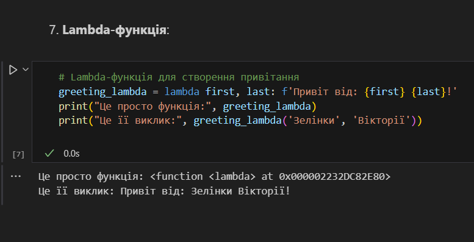

# Лабораторна робота №2
## Тема: Основи програмування на Python  
### Мета роботи: Ознайомитися з основними конструкціями та можливостями Python.

---
## Виконання роботи
* ### Результати виконання завдань:
    1. Створила [файл](./main.ipynb) із базовими прикладами Python-кодів, в якому користувач має змогу ознайомитися із усіма цими прикладами- із різними типами даних та основними Python-конструкціями.
    1. Ознайомилася із циклами `for`, `while`, також - із структурами `if` та `try-except`.
    1. Використала контекст-менеджер `with`, яка використовується для роботи з файлами.
    1. Створила Lambda-функцію, як я її розумію, після чого виконала її:
    

---
## Висновок:
- Отже, у цій роботі мною було створено файл із базовими прикладами Python-кодів. 
- Також, у цій роботі я ознайомилася із із різними типами даних та основними Python-конструкціями. 
- Також було досягнуто мету роботи: ознайомитися з основними конструкціями та можливостями Python. 
- Всі завдання виконано, проблем та труднощів це не викликало. Пропозицій немає, курс чудовий.
---
⠀⠀⠀⠀